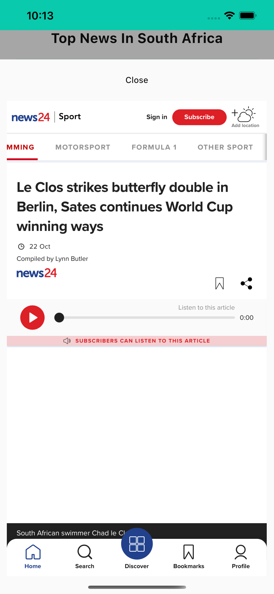

# WhatNews - ScopedModel architecture (WIP)

This project contains files to be included in any version of the WhatNews App. The application uses the Scoped Model Architecture, explained in the below sections. I could have chosen other state management patterns like bloc, but this App is reasonably straightforward.

### Scoped Model

ScopedModel is not a pattern for large apps, but by using it this way, you can push the limits of what you can achieve in terms of the size of your apps.

There are two methodologies when creating an app using ScopedModel, that I've seen. In both of these, the actual work is delegated to services. The Model uses services and their functionality to produce the correct state for the app UI based on the user's interactions.

#### One AppModel with FeatureModel mixins

In this way, you have one AppModel that extends Mixins, which are also of type Model but groups certain functionality together. UserModel, AuthenticationModel, InformationModel, etc. You pass the combined one AppModel from the top of your application widget tree and access it anywhere in the App using the ScopedModelDescendent.

**Pros:**

- State is managed in one place (and all the benefits of that).
- All functionality is Easily accessible from one Model using inherited widget functionality.
- Combining multiple functionalities can be done in the Main AppModel class since all feature model functionalities are available through the mixins.

**Cons:**

- notifyListeners can have multiple bindings alive at any point.
- All state is reduced per view without any clear indication inside the Model which parts of the state is there for a specific view.
- View-specific models have to keep a reference to the main AppModel in case of custom view-only state functionality. Like views that have three different internal states for different UI.

#### One Model per view

**Pros:**

- View has its own dedicated Model
- All state functionality and reduction for a view is contained in its own Model
- Better logical and mental grouping (View + View's Model)

**Cons:**

- More Models to be aware of and manage
- More boilerplate code when creating a new view ([appskeletons](https://www.appskeletons.com) can take care of that :)
- Harder to make use of Logic from other models (which should never happen anyway)

I have implemented my first production Flutter app for a client using ScopedModel with the first structure I described. For this template, I am now leaning towards the second one because of how mixed up the state management became, having to cater for multiple views from a single feature model.

### The implementation

This project starts off by registering all the services and available app models in the `service_locator.dart` file. We use [get_it](https://pub.dartlang.org/packages/get_it) for our dependency injection. `setupLocator` is called before the application is instantiated in `main. dart` to ensure that all services are available from the locator. To use the locator anywhere, import `service_locator.dart` and use locator< Type>() to get your registered instance.

Each view has a ScopedModel at the root and gets the Model from the locator. The Model's binding functionality is accessed using the ScopedModelDescendant.

## Getting Started

1. Make sure all the packages are fetched. Run the flutter packages get command or open Pubspec.yaml and save.
2. Go to debug tab (in Visual Code) and set the configuration to Dart & Flutter. Ignore Android Studio
3. Run the application

## Structure and placement

The root folder is split into five sections, models, scoped models, services, UI and enums.

### Enums

These are custom data types used for various purposes within the application
The naming convention for these hasn't been established yet

### Models

Contains all the application's data models. If multiple models belong to certain features, I recommend placing them in their folders to keep the code clean.
**Naming convention:** [purpose]\_model.dart i.e. login_response_model.dart

### Scoped Models

You'll place all the models associated with your views in this scoped models folder. One per view.

**Naming convention:** [viewname]\_scoped_model.dart i.e. home_scoped_model.dart

### Services

This will contain separate services that house your App's actual functionality. Fetching information, caching it locally, updating the DB, all those should be separate services in here. Registering these with the service locator is usually registered as a singleton.

**Naming convention:** [functionality]\_service.dart i.e. authentication_service.dart

### UI

Contains all the code relating to the user interface. Flutter is a code-first approach to building UI (which is excellent), so all the code files can live together in harmony without having to fuss about if it's an asset or a code file like in native programming. We only have one folder (as a start), and with more code, I usually introduce a components folder as well as a util folder for shared UI helper functions. The structure is as follows.

**views/**: Contains the files for each of the views in your applications.

Naming convention: [viewname]\_view.dart

### UI-Widgets

Contains all the code relating to the user reusable interface widgets. Flutter is a code-first approach to building UI (which is excellent), so all the code files can live together in harmony without having to fuss about if it's an asset or a code file like in native programming. We only have one folder (as a start), and with more code, I usually introduce a components folder and a util folder for shared UI helper functions. The structure is as follows.

**UI/widgets/**: Contains the folders and files for every Type of widget defined by the App.

Naming convention: [widget_purpose]\_view.dart

### Responsiveness

1. SizeConfig
   The primary purpose of the App is to resolve the issue of flutter rendering the size of UI elements as they are. For example, if we set a container size to a width of 400 and a height of 600, the container will render differently depending on the device's size. Screen flutter does not care much to scale this accordingly so that the UI will look slightly better or worse depending on perspective. For context, see the screenshot below.

This depends on the `SizeConfig` class to assign sizes to all UI components within the App. No other way should be implemented unless agreed upon
example usage:
`ButtonWidget( width: SizeConfig.safeBlockHorizontal*10, height:SizeConfig.safeBlockVertical*10 );`
SafeBlockHorizontal- Refers to the left and right of the screen or the width of the screen
safeBlockVertical - Refers to the up and down of the screen or the height below the status bar
blockVertical- Refers to the entire height of the screen, including the status bar
BlockHorizontal- Refers to the entire width of the screen

I always use the safe\*\*\* option, which excludes the status bar. As illustrated by the previous example, we always want to avoid including the status bar when allocating sizes to widgets.

### Environment variables

Environment variables are defined under the asset/environment/.env file.

### Caching Strategy

For caching i used the FFCache package <a href="https://pub.dev/packages/ffcache" target="_blank">FFCache</a> with each cache entry a timeout of 1 hour is applied by design according to the FFCache docs all cache entries are deleted after 1 day. See cache implementation under the classes folder.

### News Article

Constructing a news article model was tricky just a bit since the goal is to make the solution as close to generic as possible. The different News API providers don't return similar data, but I had to make a decision as to generic I wanted the Models to be and ended with the below structure.

```
- NewsArticleSourceModel source;
- String author;
- String title;
- String description;
- String URL;
- String urlToImage;
- DateTime publishedAt;
- String content;
```

This was the most common response from the API providers I came across. The <b> source</b> property represents the Source that produced the article and takes the following structure.

```
- String id;
- String name;
```

### News API

For fetching news articles, there is a NewsRepository interface which defines the different ways to fetch articles. I have limited this to the following.

```
- getNewArticles()
  This fetches all articles based on the user's location, which is set during the initialization of the App
- getNewArticlesMentions()
  This function fetches articles that mention keywords passed in to function, e.g. Tesla, NBA etc
- getNewArticlesBySource()
  This function returns articles by Source, e.g. New York Times, TechCrunch
- getNewsSources()
  This function fetches all sources which are supported by the current API provider. These are then used for searching for articles
- getNewArticlesBySourceAndCountry()
  This article fetches all articles by country and Source
- setupAPIService()
  This function initializes the API services; this requires passing in an API key and baseURL for the API key provider.
```

For testing purpose i used the <a href=" https://newsapi.org/" target="_blank">NewsAPI</a> provider.

### How to run

To run this project, you need to have flutter `Flutter (Channel stable, 2.5.3).`

### Please create the environment folder under the asset folder and create the .env file there

### Building App

1. For Android, if using <b>Android Studio</b>
   1. At the top bar, Navigate to the Build Option
   2. Click on it and select Flutter
   3. From the Drop down menu, select Build <b> Build APK</b> if you want to get an APK
   4. From the Drop down menu, select Build <b> Build App Bundle</b> if you want to upload the App to the AppStore for testing or production
   5. The build folder located in the project root folder will contain the output of either the APK or bundle
   6. To find the app bundle navigate to `build/app/outputs/bundle/release.`
2. For IoS if using <b> Android Studio</b>
   1. At the bottom of the screen/IDE, click on the terminal
   2. Copy and paste the following `flutter clean && flutter build IPA --release.`
   3. Once that has been completed, navigate to the ios folder inside the WhatNews project. Assuming you are using a Mac book, you need to do this via the `Finder.`
   4. Once there, navigate to the `build` folder and select the ios folder
   5. Then navigate to the `ios/archive` folder. When there, double-click on the file; this will open up Xcode, which you can use to deploy to TestFlight

### Environment variables

See <b>.env.sample</b> file

### Challenges

- The biggest challenge I faced was related to the API not returning the text version of the News Article. This requires some further work to scrap the data from the hosted news source, but that's out of scope for this task, so instead, I decided I would render the news article via a web view instead of a custom view
- Based on the above challenge, I wasn't able to get the word frequency of each article since it requires further scraping from the host
- I couldn't unit-test the exact NewsRepository service since it uses caching, which requires access to a temporary directory. Since running unit tests using flutter does occur on a simulated device, this is not possible. I was tempted to mock functionality, but it didn't help since it won't be an indication of the implementation used by the app.

### Screenshots





### APK

<a href="https://siasky.net/AAD1GRvaGayGm60iN4cs_Wm737b3gt6AT48fSY1q7ZQy8A" target="_blank">WhatNews APK</a>
